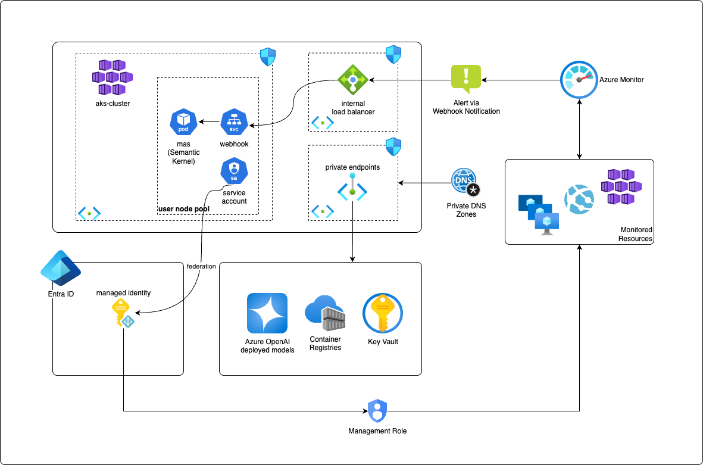

# Agentic AIOps with Semantic Kernel
Multi-agent architecture using Magentic Orchestration from Semantic Kernel

## Table of Contents
- [Overview](#overview)
- [Prerequisites](#prerequisites)
- [Installation](#installation)
- [Configure and Run](#configure-and-run)
- [Usage](#usage)
- [Architecture](#architecture)
- [Security](#security)
- [Contributing](#contributing)
- [License](#license)

## Overview
This project implements a multi-agent system using Magentic Orchestration from Semantic Kernel, deployed on Azure Kubernetes Service (AKS). The system monitors Azure Monitor events to automatically diagnose and resolve AKS cluster issues, demonstrating how AI agents enhance Kubernetes operations.



### Components deployed in AKS

- Webhook: service that publishes the webhook endpoint to receive the alert from Azure Monitor.
 - mas: Multi-Agent System responsible to implement the webhook to receive the Azure Monitor alert and implement the Semantic Kernel (kernel, magentic orchestration, agents and tools).
  - Service Account: this service account is used in the workload identity model. This service account is federated to a managed identity that could have permissions in the monitored resource, allowing for instance to execute commands like kubeclt, query azure monitor logs, etc. It allows the agents to use the Azure RBAC as a guardrail for the agents. 

## Prerequisites
- Python 3.13.2
- Docker (optional)
- Azure account with OpenAI service
- Azure Monitor workspace

## Installation

### Local Development
1. Clone the repository
2. Create a virtual environment:
   ```bash
   python3.12 -m venv venv
   source venv/bin/activate  # On Windows: venv\Scripts\activate
   ```
3. Install dependencies:
   ```bash
   pip install -r requirements.txt
   ```

## Configure and run

### Configuration
Copy `.env.example` in the same directory, rename it to .env and update it with your configuration:

```txt
# Server Configuration
PORT=8080
ENVIRONMENT=dev

# Azure OpenAI Configuration
AZURE_OPENAI_DEPLOYMENT=your-deployment-name
AZURE_OPENAI_MODEL=your-model-name
AZURE_OPENAI_API_VERSION=your-model-api-version
AZURE_OPENAI_ENDPOINT=https://your-endpoint.openai.azure.com/
AZURE_OPENAI_API_KEY=your-api-key
LLM_MODEL_SCOPE=https://cognitiveservices.azure.com/.default
```

Important: the LLM_MODEL_SCOPE is used only when you are using workload identity authentication model. In this scenario, you can ommit AZURE_OPENAI_API_KEY as it used azure identity to authenticate to Azure OpenAI deployment.

### Docker
1. Build the image:
   ```bash
   docker build -t mas-app .
   ```
2. Run the container point the env file:
   ```bash
   docker run --env-file .env -p 8080:8080 mas-app
   ```

## Usage

### API Endpoints
- POST `/alert`: Submit an alert sample for the agents to process. Replace the PLACEHOLDER with the json from the following sample: https://learn.microsoft.com/en-us/azure/azure-monitor/alerts/alerts-common-schema#sample-log-search-alert-when-the-monitoringservice--log-analytics
  ```bash
  curl -X POST http://localhost:8080/alert \
    -H "Content-Type: application/json" \
    -d 'PLACEHOLDER'
  ```

### Available Agents
- AKS Specialist: Manages Kubernetes operations
- Azure Monitor Specialist: Handles Azure Monitor queries

## Architecture
The architecture runs the MAS in Azure Kubernetes Service as a deployment. It is a full stateless application at the Kubernetes level and relies on external services to persist any information such as secrets or AI Agents history. The agents use AKS workload identity model to access resources needed to perform their jobs.

## Security
- All sensitive information should be stored in environment variables
- Use Azure Key Vault for production secrets
- Follow the principle of least privilege
- Regularly rotate API keys and credentials
- Monitor and audit access to sensitive resources

## Contributing
Please read [CONTRIBUTING.md](CONTRIBUTING.md) for details on our code of conduct and the process for submitting pull requests.

## License
This project is licensed under the MIT License - see the [LICENSE](LICENSE) file for details.
